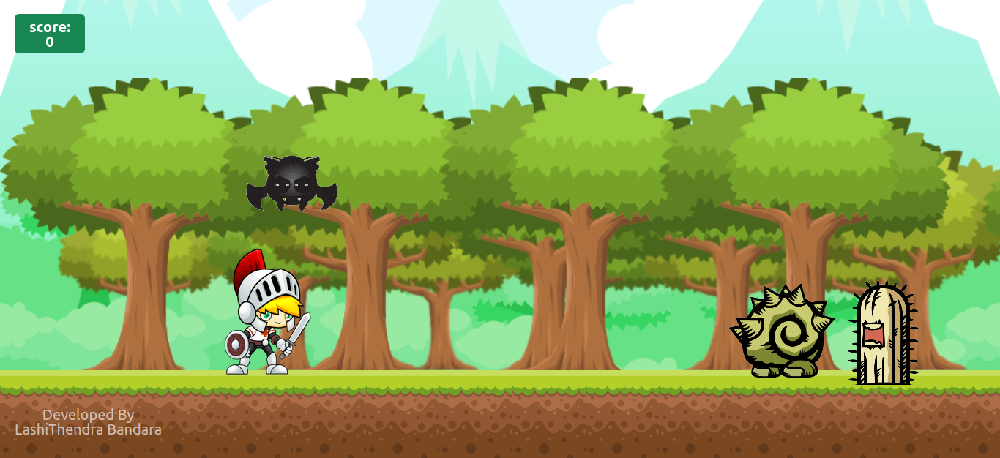
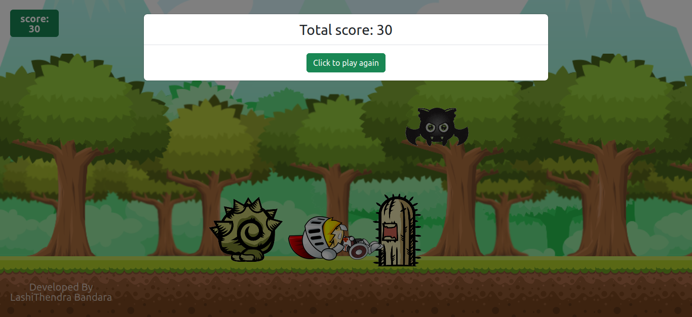

# Knight Adventure
This is a simple game built using vanilla HTML, CSS, and JavaScript, along with some Bootstrap and jQuery. The objective of the game is to control a character that can run, jump, and attack. The character can be moved using the left and right arrow keys, while the D key is used to attack and the space bar is used to jump.

As you progress further in the game, you earn more points. Points can be gained by both progressing in the game and defeating creatures. The game features a scoring system to keep track of your achievements.

The visuals of the game are enhanced by implementing character animations using single image elements. The game also includes animated GIFs for the enemies, adding more variety and visual interest.

### Version
1.0.0

### How to Play
1. Use the left arrow key to move the character to the left.
2. Use the right arrow key to move the character to the right.
3. Press the D key to attack enemies.
4. Press the space bar to make the character jump.

### Screenshots

### License
This project is licensed under the MIT License.
